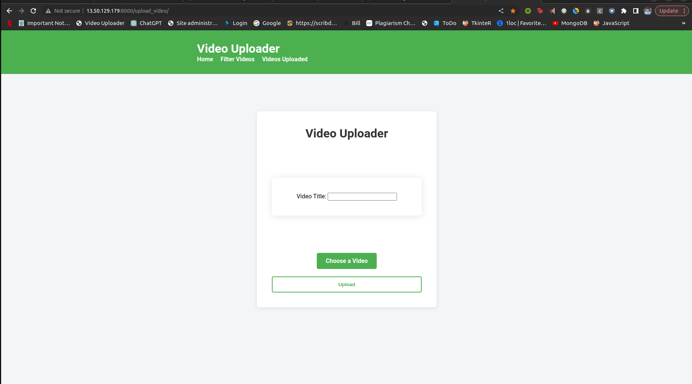
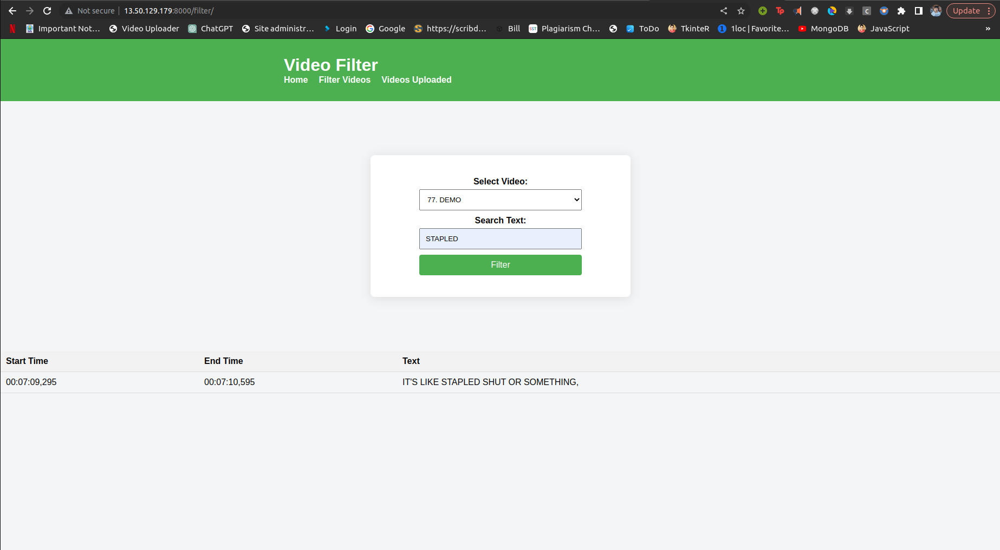
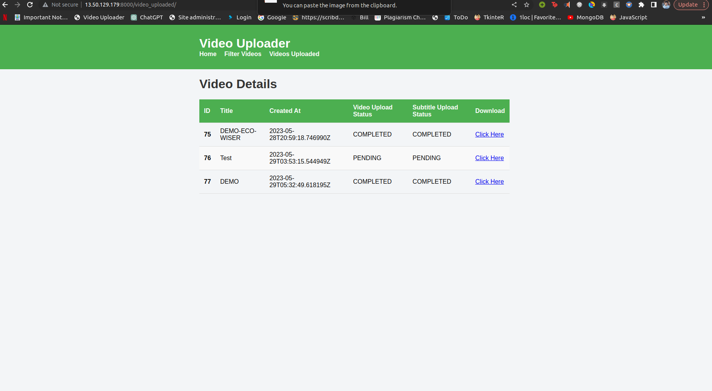

# Video Subtitle Creation and Search App

This repository contains the code for a web application that allows users to upload videos, process them to extract subtitles, and search for specific keywords within the subtitles. The backend is built using Django and utilizes AWS services like S3 for video storage and DynamoDB for keyword indexing.

## Requirements

To run the application locally, you need to have the following components installed:

- Python 3.x
- Django
- ccextractor binary
- Docker
- Docker Compose
- git

## Installation

To run the application using Docker, follow these steps:

1. Clone this repository to your local machine:

```bash
git clone <repository_url>
```
2. Build the Docker image:

```bash
cd <repository_directory>
sudo docker build -t subtitletimetracker:latest .
```

3. Run the Docker containers:
```bash
sudo docker-compose up --build -d
```


## Configuration

Before running the application, you need to configure the AWS credentials and other settings. Modify the `settings.py` file located in the `config` directory.

- Set the AWS access key and secret access key in the `AWS_ACCESS_KEY_ID` and `AWS_SECRET_ACCESS_KEY` variables, respectively.
- Configure the S3 bucket name in the `S3_BUCKET_NAME` variable.
- Adjust other settings as per your requirements.
- set env variables of aws as per your account

## Usage

To start the application, run the following command:

The application will start and be accessible at `http://localhost:8000`.

## Uploading and Processing Videos

1. Visit the web application in your browser.
2. Click on the "Upload Video" button.
3. Choose a video file from your local machine and click "Upload".
4. The application will start processing the video, extracting subtitles using the ccextractor binary.
5. After processing is complete, the video will be stored in the configured S3 bucket, and the subtitles will be indexed in DynamoDB.

## Searching for Keywords

1. In the web application, enter a keyword or phrase in the search bar.
2. Click the "Search" button.
3. The application will retrieve the relevant time segments from DynamoDB where the keyword is mentioned in the video's subtitles.
4. Display the search results to the user.

## Sample Video

You can use the following sample video file for testing the ccextractor functionality:

[Sample Video](https://drive.google.com/file/d/1gLi5ho33TIRNVZkSE-gD4S24zs6Xy1ci/view?usp=sharing)

## Screenshots

Include screenshots of the application here. Below are some examples:





## License

This project is licensed under the [MIT License](LICENSE).


